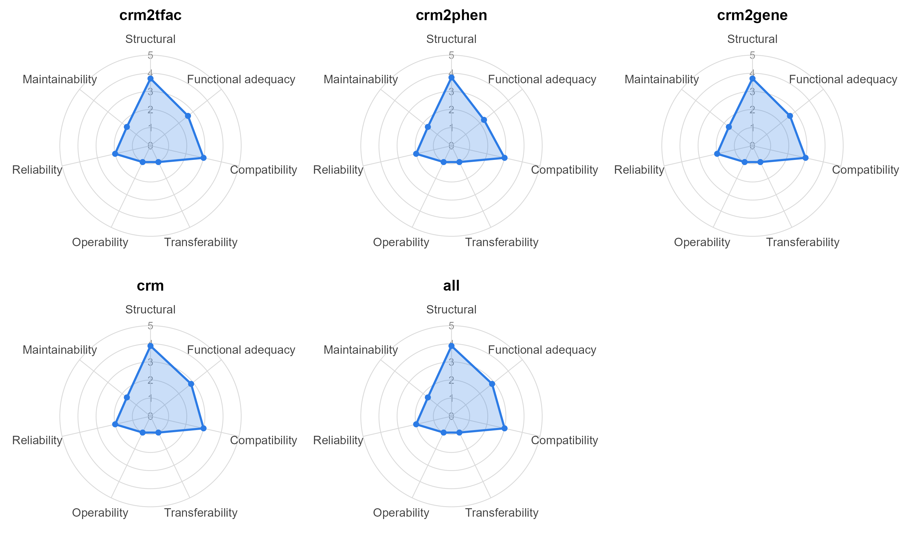
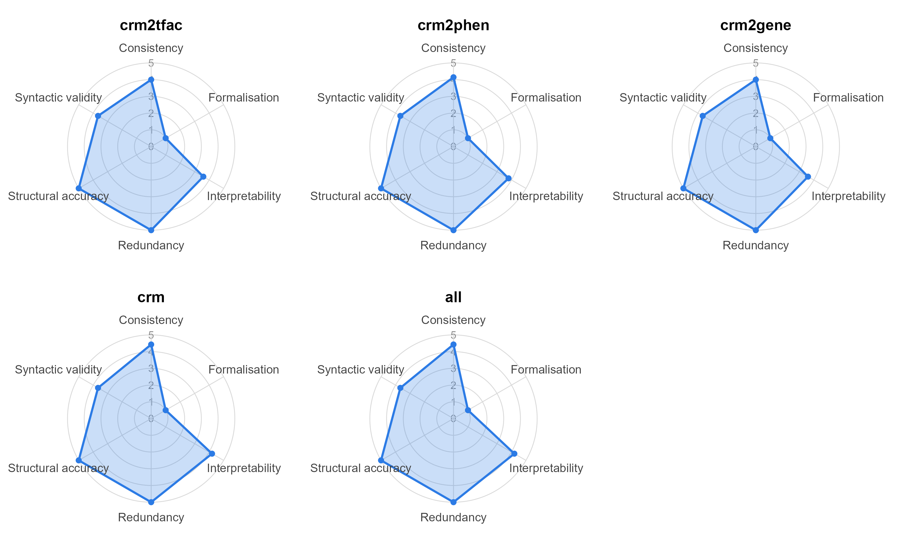
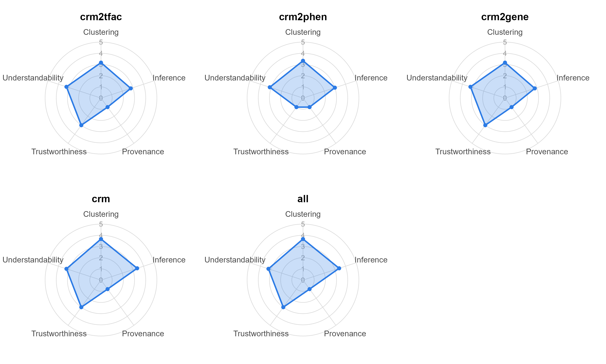
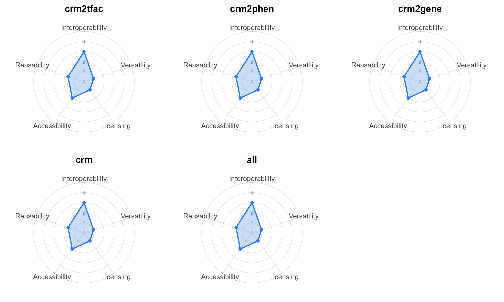

# Analysis of BioGateway Knowledge Graphs

This study evaluates the quality of selected knowledge graphs from the BioGateway knowledge network by applying OQuaRE-KG. BioGateway provides knowledge graphs on the gene regulation domain, with a particular focus on enhancers, which are the most widely studied of the cis-regulatory modules. These sequences were modelled using the CisReg schema, which was also used in BioGateway to integrate data from 25 different sources, modelling information from various biological databases about enhancers and their relations with other entities.

  
The next table describes the size in triples of the graphs included in this evaluation, which were selected from the existing [Cis-Regulatory modules KGs](./biogateway/graphs/original/)

| CRM Graph | Triples | 
|-----------|---------|
| crm2tfac  | 12,933  | 
| crm2phen  | 45,794  | 
| crm2gene  | 282,491 | 
| crm       | 1,483,949 
| all       | 1,622,550 

##  Evaluation of the OQuaRE-KG framework: Cisreg graphs.

The values of the OQuaRE-KG quality metrics were calculated for the Cisreg graphs and scaled the values into score at the level of metrics, subcharacteristics and characteristics. The focus here is on the results at the characteristics and subcharacteristics level. However, the [raw value](./biogateway/results/original_cisreg_graphs/original_cisreg_raw_metrics.csv) of the metrics, and the quality score (scaled value) of the [metrics](./biogateway/results/original_cisreg_graphs/original_cisreg_metrics_likert.csv), [subcharacteristics](./biogateway/results/original_cisreg_graphs/original_cisreg_subcharacteristics_likert.csv) and [characteristics](./biogateway/results/original_cisreg_graphs/original_cisreg_characteristics_likert.csv) are also available.

At the level of characteristics (Figure 1), the analysis of the scores shows differences between the graphs for the structural and functional adequacy characteristics. However, all graphs have the same quality score for compatibility, transferability, operability, reliability, and maintainability.

*Figure 1: The radar chart at the level of characteristics.*

The results of the subcharacteristics of structural and functional adequacy show differences between graphs:

* Structural subcharacteristic (Figure 2): all graphs get the same score for formalisation, structural accuracy, and redundancy. The differences between graphs are exhibited for consistency, syntactic validity and interpretability.

    
    *Figure 2: The radar chart for the structural subcharacteristics.*

* Functional adequacy subcharacteristic (Figure 3): the difference in quality scores happen for the following subcharacteristics: inference, trustworthiness and clustering.

    
    *Figure 3: The radar chart for the functional adequacy subcharacteristics.*

All graphs have the same quality score for the subcharacteristics of interoperability, versatility, licensing, accesibility, reusability (Figure 4).

*Figure 4: The radar chart for the subcharacteristics of interoperability, versatility, licensing, accesibility, reusability.*
